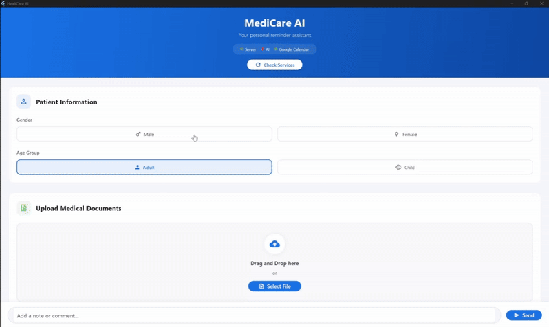

# HealthCare-AI

## Overview

HealthCare-AI is an intelligent application designed to help users remember to take their medication. By leveraging AI and Google Calendar integration, the app schedules reminders and provides helpful notifications to ensure you never miss a dose. Perfect for those with complex medication schedules or anyone who occasionally forgets to take their pills on time.

## Key Features

- AI-powered scheduling and reminders for medications
- Seamless integration with Google Calendar
- User-friendly interface for managing pill routines
- Smart notification system that adapts to your daily routine
- Medication tracking and adherence statistics
- Support for multiple medications with different schedules

## How it Works

The app uses an AI backend to analyze your medication schedule and automatically create calendar events in your Google Calendar. These events act as reminders, helping you stay on track with your medications.

1. **Input your medications**: Enter details about your prescriptions including name, dosage, frequency, and preferred times.
2. **AI analysis**: Our system analyzes your medication requirements and your calendar to find optimal reminder times.
3. **Calendar integration**: Reminders are automatically added to your Google Calendar.
4. **Smart notifications**: Receive timely alerts before you need to take your medication.
5. **Adherence tracking**: The app tracks when you confirm taking medications to help monitor your adherence.

---

## App Demo

---

## Architecture

### Backend

The backend is built with a robust architecture that handles all the complex operations:

- **AI Engine**: 
  - Analyzes medication requirements and timing
  - Uses machine learning to optimize reminder schedules based on user habits
  - Implements natural language processing to understand medication instructions
  - Provides personalized recommendations for better medication adherence
- **Calendar Integration Service**: 
  - Connects with Google Calendar API
  - Creates, updates, and manages reminder events
  - Handles scheduling conflicts intelligently
- **Notification System**: Manages the delivery of timely reminders across different platforms
- **Analytics Module**: Tracks medication adherence and generates insights for users

The backend is built for scalability and reliability. Each component operates independently while communicating through well-defined APIs.

### Frontend

You can run the `app-build` as the front-end to interact with the application. The frontend provides:

---

## Getting Started

### Prerequisites
- Google account for Calendar integration
- Internet connection
- GPU for running the AI

### Installation
1. Clone this repository
2. Configure backend services (detailed instructions in the `/backend` directory)
3. Run the `app-build` to start the frontend application

### Configuration
1. Sign in with your Google account
2. Grant calendar permissions when prompted
3. Enter your medication information
4. Set your preferences for notifications

### Usage
- Add new medications through the "Add Medication" screen
- View your upcoming doses on the dashboard
- Confirm when you've taken medications by clicking on notifications
- Check your adherence statistics in the "Reports" section

---

## Technical Details

### Technologies Used
- Backend: AI powered by Ollama, cloud-based services
- Computer Vision: EasyOCR for medication label scanning and recognition
- API Framework: FastAPI for building APIs
- External APIs: Google Calendar API, notification services
---

## Support and Contribution

For support requests, please open an issue in this repository.

Contributions to improve HealthCare-AI are welcome! Please see our contribution guidelines for more information.

---
